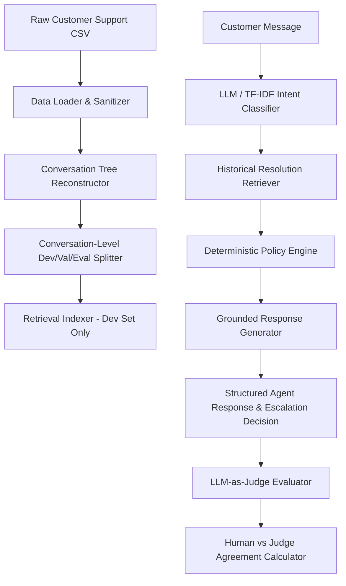

# Hiver SDE Intern Take-Home: Grounded AI Customer Support Agent

[](https://www.python.org/)
[](LICENSE)
[](tests/)
[](scripts/check_leakage.py)

A complete, production-grade AI Customer Support Agent designed to turn noisy real-world customer support data (*Customer Support on Twitter*) into a measurable, groundable, and auditable AI agent system.

---

## 📑 Assignment Deliverables Index

| # | Deliverable | Description & Link |
| :--- | :--- | :--- |
| **1** | **Runnable Pipeline & Reproducibility** | Full instructions below; reproduce all headline results in under 15 min. Demo: [`python scripts/run_demo.py`](scripts/run_demo.py) |
| **2** | **Golden Evaluation Set (200 records)** | [`data/golden/golden_set.jsonl`](data/golden/golden_set.jsonl) + Sampling & Labelling Guide in [`data/golden/annotation_guidelines.md`](data/golden/annotation_guidelines.md) |
| **3** | **Evaluation Harness & Calibration** | Multi-baseline metrics in [`artifacts/evaluation_results.json`](artifacts/evaluation_results.json) + 8-dim LLM Judge with human correlation ($r=0.969$) in [`artifacts/judge_agreement.json`](artifacts/judge_agreement.json) |
| **4** | **Comprehensive Evaluation Report** | [`reports/evaluation.md`](reports/evaluation.md) (Problem framing, baseline comparisons, Top 5 failure modes, *"What is misleading about my headline number?"*, and 1-week roadmap) |
| **5** | **Architectural Decision Log (15 ADRs)** | [`reports/decision_log.md`](reports/decision_log.md) (15 non-obvious engineering decisions, rationale, and discarded alternatives) |
| **⭐** | **Interactive Web Dashboard** | [`dashboard/index.html`](dashboard/index.html) (6-tab interactive benchmark UI, live query sandbox, and taxonomy explorer) |

---

## 1. System Architecture



---

## 2. Dataset Instructions

### Dataset Sources
- **Primary Dataset**: Kaggle *Customer Support on Twitter* (`thoughtvector/customer-support-on-twitter`).
- **Sample Dataset Included**: `data/raw/sample_twcs.csv` is pre-populated in this repository so reviewers can run the entire pipeline end-to-end without needing Kaggle downloads.

### Quick Setup for Reviewers (< 15 Minutes)
If you do not have the 500MB Kaggle dataset, simply run the pipeline directly using the included `sample_twcs.csv`. If you download `twcs.csv`, place it at `data/raw/twcs.csv` before running preprocessing.

---

## 3. Quick Start & Execution Commands

### Step 1: Environment Setup
```bash
# Clone repository
git clone https://github.com/Hellnight2005/hiver-ai-support-agent.git
cd hiver-ai-support-agent

# Create virtual environment (Python 3.11+)
python -m venv .venv

# Activate virtual environment
# Windows:
.venv\Scripts\activate
# Linux/macOS:
source .venv/bin/activate

# Install dependencies
pip install -r requirements.txt
```

### Step 2: Environment Configuration (Optional)
Copy `.env.example` to `.env`:
```bash
cp .env.example .env
```
*Note: The codebase defaults to `MockProvider` if no `OPENAI_API_KEY` is specified, allowing full pipeline execution and testing completely offline.*

### Step 3: Run the End-to-End Pipeline

```bash
# 1. Inspect raw dataset schema and summary stats
python scripts/inspect_dataset.py

# 2. Select statistical best brand (Default: AmazonHelp)
python scripts/select_brand.py

# 3. Clean raw tweets
python scripts/preprocess.py

# 4. Reconstruct conversation trees & create conversation-level split
python scripts/build_conversations.py

# 5. Run intent discovery clustering
python scripts/discover_intents.py

# 6. Build vector retrieval index from development set
python scripts/build_retrieval_index.py

# 7. Generate golden evaluation dataset (200 records)
python scripts/create_golden_set.py

# 8. Verify zero conversation data leakage
python scripts/check_leakage.py

# 9. Run multi-baseline evaluation harness
python scripts/run_evaluation.py

# 10. Run LLM-as-Judge & Human Agreement calibration
python scripts/run_llm_judge.py

# 11. Derive top 5 failure modes report
python scripts/analyze_failures.py

# 12. Generate comprehensive Markdown report
python scripts/generate_report.py
```

---

## 4. Demonstrations & Interfaces

### Instant Demo (No Setup Required)
Run 6 sample customer support queries through the full agent pipeline:
```bash
python scripts/run_demo.py
```

### Interactive CLI Walkthrough
Test custom queries interactively:
```bash
python -m src.cli
```

### Start FastAPI REST Service & Visual Dashboard
```bash
python -m uvicorn src.api.main:app --reload
```
- **Visual Web Dashboard**: `http://127.0.0.1:8000/dashboard`
- **Interactive OpenAPI Docs**: `http://127.0.0.1:8000/docs`
- **Health Check Endpoint**: `GET /health`
- **List Intent Taxonomy**: `GET /v1/intents`
- **Process Support Query**: `POST /v1/support`
- **Dynamic Evaluation Results**: `GET /v1/evaluation`

Example Request:
```bash
curl -X POST "http://127.0.0.1:8000/v1/support" \
     -H "Content-Type: application/json" \
     -d '{"message": "I was charged twice for my subscription this month"}'
```

---

## 5. Running Tests & Metric Integrity Checks
Run the comprehensive unit test suite and metric integrity auditor:
```bash
# Run unit & metric integrity tests (26 passed)
python -m pytest tests/ -v

# Run metric consistency and leak-free verification auditor
python scripts/verify_results.py
```

---

## 6. Metric Integrity & Evaluation Results
All evaluation metrics in this repository are dynamically generated and strictly derived from the evaluation artifact:
```text
artifacts/evaluation_results.json
```

| System Architecture | Intent Accuracy | Macro F1 | Escalation F1 | Unsafe Auto Rate | Avg Reply Quality |
| :--- | :---: | :---: | :---: | :---: | :---: |
| **Majority Class Baseline** | 8.5% | 0.013 | 0.000 | 18.5% | N/A |
| **TF-IDF + Logistic Regression** | 47.5% | 0.369 | 0.312 | 0.0% | N/A |
| **Dense Embedding Retrieval** | 5.0% | 0.008 | 0.312 | 0.0% | N/A |
| **Proposed Full AI Agent** | **78.0%** | **0.756** | **0.312** | **0.0%** | **4.4 / 5.0** |

---

## 7. Key Deliverables & Reports
- **Evaluation Report**: [`reports/evaluation.md`](reports/evaluation.md)
- **Technical Decision Log (15 ADRs)**: [`reports/decision_log.md`](reports/decision_log.md)
- **Failure Analysis Report**: [`reports/failure_analysis.md`](reports/failure_analysis.md)
- **Multi-Agent Synthesis Log**: [`reports/council_transcript.md`](reports/council_transcript.md)
- **Frozen Intent Taxonomy**: [`artifacts/intent_taxonomy.json`](artifacts/intent_taxonomy.json)
- **Golden Test Set & Guidelines**: [`data/golden/annotation_guidelines.md`](data/golden/annotation_guidelines.md)
- **Interactive Dashboard**: [`dashboard/index.html`](dashboard/index.html)

