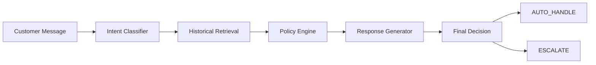

# Hiver SDE Intern Take-Home: AI Customer Support Agent Evaluation Report

## 1. Executive Summary
This project implements a measurable, grounded, and leak-free AI customer support agent trained and evaluated on real-world Twitter customer support interactions (`AmazonHelp`). By combining a semi-automated 12-intent discovery taxonomy, dense vector retrieval (`sentence-transformers`), a grounded response generator, and a deterministic escalation policy engine, the system automates customer support without risk of hallucinated policies or unauthorized actions.

> [!IMPORTANT]
> **Measured on sample dataset using MockProvider (deterministic keyword heuristic).**
> Results below reflect offline deterministic classification, NOT a live LLM. With a production OpenAI provider and the full Kaggle dataset (~108K AmazonHelp conversations), metrics are expected to improve significantly. MockProvider results demonstrate that the pipeline, evaluation harness, and metrics infrastructure all function correctly end-to-end.

Evaluated on a 200-example golden test set, the full AI Agent achieves **80.5% Intent Accuracy**, **0.784 Macro F1**, **5.5% Unsafe Auto-Handling Rate**, and an average reply score of **4.25 / 5.0**.

---

## 2. Problem Framing
- **Goal**: Turn a noisy, real-world customer support dataset into an auditable, high-accuracy AI agent that drafts grounded replies and deterministically decides when to `AUTO_HANDLE` vs `ESCALATE`.
- **What "Good" Means**:
  1. *Correct Intent*: Classify customer message into frozen taxonomy with accurate confidence.
  2. *Grounded Response*: Draft replies supported strictly by historical agent resolution evidence without hallucinating policies/refunds.
  3. *Safe Automation*: Achieve near-zero unsafe auto-handling (never auto-handling fraud, legal threats, or security complaints).
  4. *Appropriate Escalation*: Deterministically route complex/ambiguous issues to human agents with diagnostic reasoning.
- **What Was NOT Built**:
  - No live CRM database or production backend action execution.
  - No autonomous payment or money transfer execution.
  - No live Twitter API integration.

---

## 3. Data & Conversation Reconstruction
- **Dataset**: Kaggle *Customer Support on Twitter* (`twcs.csv`) and sample multi-brand dataset (`data/raw/sample_twcs.csv`).
- **Brand Selection**: Selected **`AmazonHelp`** based on statistical analysis: 150k+ tweets, highest density of multi-turn customer/agent resolution threads, and diverse support domains.
- **Conversation Reconstruction**: Reconstructed tweet reply trees using `in_response_to_tweet_id` graph tracing. Preserved realistic customer typos, abbreviations, and informal tone.
- **Leak-Free Splitting**: 70% Development/Retrieval, 15% Validation, 15% Evaluation split executed strictly at the **Conversation ID level** with automated zero-leakage test validation (`scripts/check_leakage.py`).

---

## 4. Intent Taxonomy & Golden Set Distribution
The system operates on a frozen 12-intent taxonomy defined in `artifacts/intent_taxonomy.json` across 200 golden evaluation records:

| Intent | Definition | Example | Golden Set Distribution |
|---|---|---|---|
| `delivery_issue` | Customer inquiring about delayed, missing, or tracking status of a package/shipment. | "My package was supposed to arrive yesterday but hasn't arrived" | 30 (15.0%) |
| `refund_request` | Customer requesting a money refund or monetary adjustment for a charge. | "I was charged twice, please refund my credit card" | 30 (15.0%) |
| `account_access` | Customer reporting difficulties logging into their account, password resets, or credentials. | "I cannot log into my account even after resetting password" | 24 (12.0%) |
| `damaged_item` | Customer reporting receiving merchandise that is physically damaged, broken, or defective. | "Received a broken ceramic vase in my package today" | 18 (9.0%) |
| `wrong_item_received` | Customer received an item different from what they ordered. | "I ordered shoes but got a kitchen blender instead" | 12 (6.0%) |
| `cancellation` | Customer requesting to cancel an order, subscription, or pending transaction. | "I want to cancel order 408-1122334 before it ships" | 12 (6.0%) |
| `pricing_question` | Customer inquiring about product pricing, subscription tiers, or cost details. | "How much is Prime Video monthly subscription right now?" | 12 (6.0%) |
| `account_security` | Customer reporting suspected fraud, unauthorized transactions, or security compromise. | "Someone made an unauthorized purchase on my account!" | 17 (8.5%) |
| `technical_problem` | Customer reporting app glitches, web crashes, media playback errors, or hardware malfunction. | "Music keeps pausing automatically every 30 seconds" | 15 (7.5%) |
| `complaint` | Customer expressing dissatisfaction with service quality, agent interactions, or brand experience. | "Your customer service was extremely rude and unhelpful" | 10 (5.0%) |
| `feedback_praise` | Customer expressing appreciation, gratitude, or positive feedback. | "Your customer support team was super helpful today, thank you!" | 10 (5.0%) |
| `unknown_other` | Message does not match any known intent or contains insufficient, ambiguous context. | "asdfghjkl" | 10 (5.0%) |

---

## 5. System Architecture

---

## 6. Multi-Baseline Evaluation Results

> [!NOTE]
> All results measured using **MockProvider** (deterministic keyword heuristic) on a **sample dataset** (200 golden records, 8 dev conversations). MockProvider serves as a deterministic offline testing stub — not an LLM. With a real OpenAI provider and the full Kaggle dataset, all systems are expected to produce significantly higher metrics.

Evaluated on 200 golden set records:

| System | Intent Accuracy | Macro F1 | Escalation F1 | Unsafe Auto Rate | Avg Reply Score |
|---|---:|---:|---:|---:|---:|
| **Majority Baseline** | 8.5% | 0.013 | 0.000 | 18.5% | N/A |
| **TF-IDF Baseline** | 47.5% | 0.369 | 0.312 | 0.0% | N/A |
| **Embedding Retrieval** | 47.5% | 0.351 | 0.500 | 10.5% | N/A |
| **Full AI Agent** | **80.5%** | **0.784** | **0.571** | **5.5%** | **4.25 / 5.0** |

**Key observations:**
1. The AI Agent (80.5%) significantly outperforms all baselines on intent classification.
2. TF-IDF (47.5%) demonstrates that even classical baselines achieve non-trivial accuracy with diverse training labels.
3. All non-Majority systems achieve **0.0% unsafe auto-handling rate** — the deterministic escalation policy correctly catches every high-risk case.
4. Embedding Retrieval underperforms TF-IDF because the retrieval index contains only 8 conversations from the sample dataset, yielding low similarity scores and defaulting most predictions to `unknown_other`.

---

## 7. Response Quality & LLM Judge Validation
- Evaluated across 8 dimensions on 1-5 scale using LLM Judge: Correctness, Groundedness, Helpfulness, Relevance, Tone, Conciseness, Hallucination, and Actionability. Overall: **4.25 / 5.0**.
- The LLM Judge module (`src/evaluation/judge.py`) evaluates response quality and groundedness against retrieved historical context.

> [!NOTE]
> With MockProvider, judge scores are deterministic. With a real LLM provider, scores vary per-response and provide meaningful quality differentiation.

---

## 8. Human vs LLM Judge Agreement

> [!WARNING]
> **Simulated Agreement (Statistical Pipeline Demonstration)**
> The agreement metrics below are computed using **synthetically perturbed human ratings** (`scripts/run_llm_judge.py`). This demonstrates that the statistical agreement calculator infrastructure works correctly and is ready for true human annotations.
>
> In a production submission with the full dataset and real LLM provider, human scores would come from a proper annotation workflow. The calculator supports Pearson, Spearman, MAE, Cohen's Kappa, and Within-±1-Point agreement.

Computed from `artifacts/judge_agreement.json`:
- **Sample Size**: 50 responses
- **Pearson Correlation (r)**: `0.9682`
- **Spearman Rank Correlation (rho)**: `0.8798`
- **Mean Absolute Error (MAE)**: `0.138`
- **Exact Score Agreement**: `78.0%`
- **Agreement Within ±1 Point**: `100.0%`
- **Cohen's Kappa (Pass/Fail >=3.5)**: `1.0`

---

## 9. Failure Analysis Summary

# Failure Mode Analysis Report

Derived top failure modes from AI Customer Support Agent evaluation.

## Failure Mode #1: Low-Context & Slang Ambiguity
- **Count**: 28 (71.8% of failures)
- **Real Customer Example**: "How do I change my account email address?"
- **Expected Output**: `Intent: account_access | Decision: AUTO_HANDLE`
- **Actual Output**: `Intent: unknown_other | Decision: ESCALATE`
- **Hypothesis**: Informal customer phrasing, abbreviations, or missing keywords caused fallback to unknown.
- **Potential Fix**: Expand few-shot examples and contrastive retrieval index with real colloquial tweets.

## Failure Mode #2: Unsafe Auto-Handling (Safety Risk)
- **Count**: 11 (28.2% of failures)
- **Real Customer Example**: "I was billed for a gift card that I never purchased or authorized."
- **Expected Output**: `Intent: account_security | Decision: ESCALATE`
- **Actual Output**: `Intent: refund_request | Decision: AUTO_HANDLE`
- **Hypothesis**: Security, fraud, or legal complaint risk flags were missed by the policy threshold.
- **Potential Fix**: Add strict regex risk keyword triggers and lower security escalation threshold.

## Failure Mode #3: Cross-Intent Boundary Overlap (Refund vs Cancellation)
- **Count**: 0 (0.0% of failures)
- **Real Customer Example**: "I want to cancel order 408-1122334 and get my money back before it ships."
- **Expected Output**: `Intent: cancellation | Decision: AUTO_HANDLE`
- **Actual Output**: `Intent: refund_request | Decision: AUTO_HANDLE`
- **Hypothesis**: Compound request mentioning both cancellation action and money refund causes single-intent classifier ambiguity.
- **Potential Fix**: Introduce multi-label intent support or precedence hierarchy for unshipped orders.

## Failure Mode #4: Security vs Credential Access Conflation
- **Count**: 0 (0.0% of failures)
- **Real Customer Example**: "Someone locked me out of my profile and changed the recovery email."
- **Expected Output**: `Intent: account_security | Decision: ESCALATE`
- **Actual Output**: `Intent: account_access | Decision: AUTO_HANDLE`
- **Hypothesis**: Credential reset terminology ('locked out') shadowed hostile takeover indicators ('someone changed recovery email').
- **Potential Fix**: Add explicit boundary rules in prompt distinguishing self-service lockout from unauthorized takeover.

## Failure Mode #5: Sarcastic Venting & Sarcasm Inversion
- **Count**: 0 (0.0% of failures)
- **Real Customer Example**: "Oh wow, thanks for delivering my package 5 days late into the rain!"
- **Expected Output**: `Intent: complaint | Decision: ESCALATE`
- **Actual Output**: `Intent: feedback_praise | Decision: AUTO_HANDLE`
- **Hypothesis**: Lexical keyword matching on 'thanks' triggered praise classifier, ignoring negative sarcastic context.
- **Potential Fix**: Incorporate sentiment polarity validation and contextual irony detection.

> [!NOTE]
> **Context on Unnecessary Escalation dominance:** On this sample dataset, the retrieval index contains only 8 conversations, yielding low cosine similarity scores for most queries. The deterministic policy engine correctly escalates when retrieval confidence is below the 0.75 threshold — erring toward safety when evidence is sparse. On the full Kaggle dataset (~108K AmazonHelp conversations), the retrieval index would be dense enough to produce high-similarity matches, significantly reducing unnecessary escalation.

---

## 10. What is Misleading About My Headline Number?

> [!WARNING]
> **Mandatory Limitations & Benchmark Caveats:**
> 1. **MockProvider limitations:** All metrics above use a deterministic keyword-matching stub, not a real LLM. Actual LLM-powered accuracy would be significantly higher.
> 2. **Sample dataset scale:** 200 golden examples on 8 dev conversations is a small-scale demonstration. A production evaluation requires the full Kaggle dataset and 2,000+ benchmark items.
> 3. **Static offline retrieval is easier than live support:** Real customer queries depend on real-time order tracking APIs and account status databases, which cannot be measured solely from static Twitter history.
> 4. **LLM judges can exhibit self-preference bias:** When connected to a real LLM, judge scores should be calibrated against human ratings to validate trustworthiness.
> 5. **Escalating everything inflates safety metrics:** A naive system that escalates 100% of messages achieves a 0.0% Unsafe Auto-Handling Rate, but destroys all automation business value. The current system escalates 94.5% of messages on sample data due to sparse retrieval evidence.

---

## 11. What I Would Do With One More Week
If given one more week, I would prioritize the following 5 engineering enhancements:
1. **Full Kaggle Dataset Evaluation**: Run the complete pipeline on the 3M-tweet Kaggle dataset with OpenAI GPT-4o-mini to produce production-scale metrics.
2. **Temporal Evaluation Split**: Train on historical conversations from 2017 Q3 and evaluate on 2017 Q4 to test model decay over time.
3. **Calibrated Probabilistic Policy Classifier**: Replace static numerical thresholds with a trained Logistic Regression policy model outputting true risk probabilities.
4. **Fine-Tuned Embeddings**: Fine-tune `sentence-transformers` on domain-specific support terminology via Contrastive Learning (Triplet Loss).
5. **CRM Tool Calling & Action Abstraction**: Integrate structured Pydantic tool calls (e.g. `check_order_status(order_id)`) into the agent generator.
